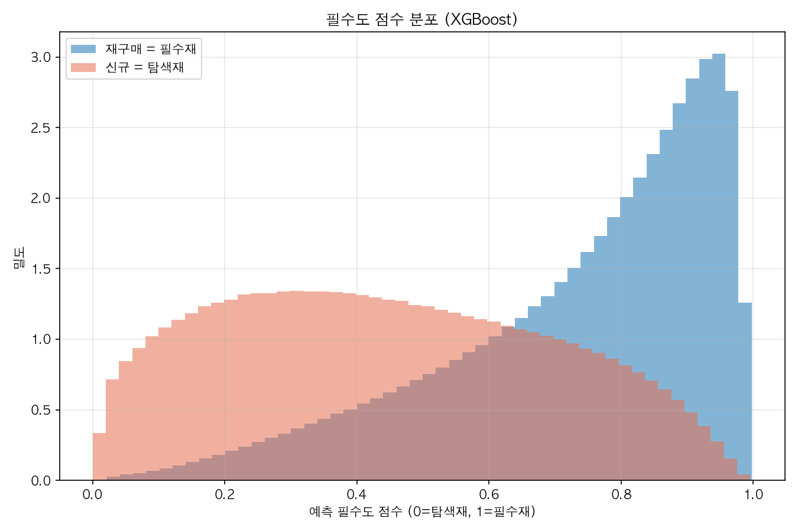
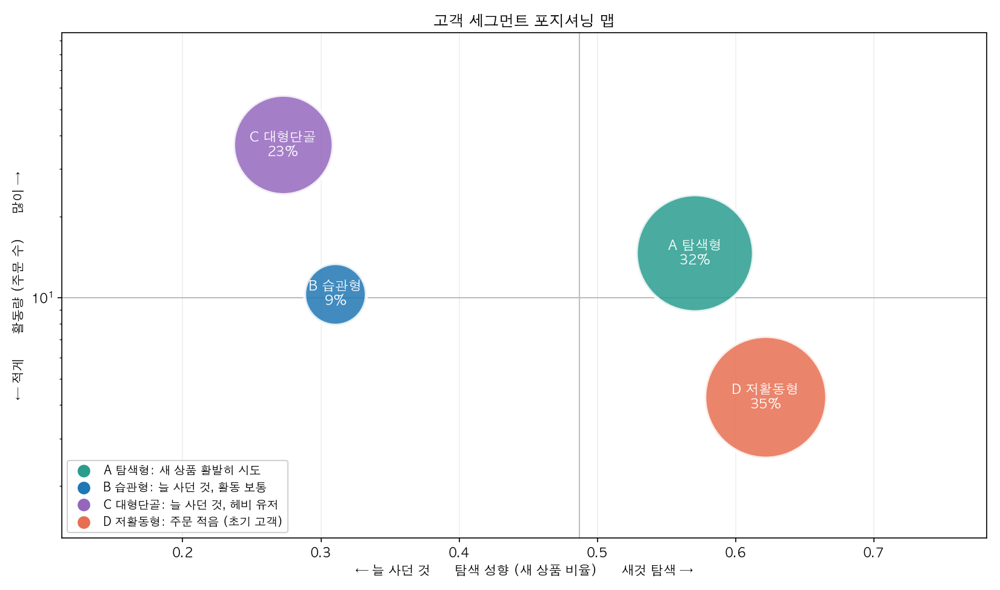
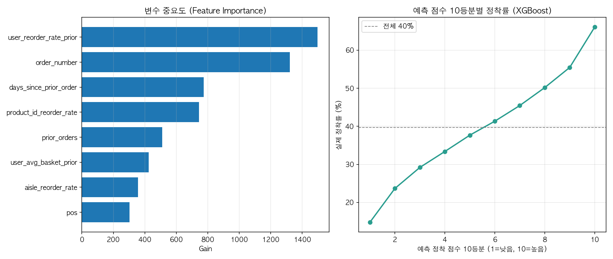

# Instacart 장바구니 순서로 읽는 고객 세그멘테이션과 추천 전략

장바구니에 담는 순서를 행동 신호로 보고, 고객을 세분화해 집단별 추천 전략을 설계한 데이터 분석 프로젝트

**전체 리포트:** [Notion 포트폴리오](https://sweltering-crane-02b.notion.site/Instacart-7d596d4e0a49827cb37d015c80fe11f8)

## 문제

온라인 장보기에서 필수품을 다 담고 새 상품을 둘러보는데 또 생필품이 추천된다. 대부분의 추천은 과거 구매 이력이나 지금 보고 있는 상품과의 연관성에 의존한다. 하지만 한 번의 장보기 안에서 지금 필수품을 담는 중인지 새 상품을 탐색하는 중인지는 읽지 못한다. 이 프로젝트는 그 신호를 **장바구니에 담는 순서**에서 찾는다.

## 핵심 결과

- 담는 순서에는 신호가 있다. 앞에 담은 상품일수록 **재구매 확률**이 높고(약 79%에서 48%로 하락), 주문 수와 장바구니 크기를 통제해도 패턴이 남는다.
- (고객, 상품)별 **필수도 점수**를 XGBoost로 매겼다(AUC 0.82). 장바구니 앞에서 뒤로 갈수록 평균 필수도가 0.74에서 0.51로 낮아진다.
- 뚜렷한 자연 군집은 없었다(DBSCAN; 실루엣 0.34, 표준상 '약한 구조'). 고객 세그멘테이션에서 약한 구조는 흔해, 탐색 성향과 활동량 두 축으로 4개 운영 세그먼트를 나눴다. 집단별 정착률이 26~50%로 차이가 뚜렷했다.
- 새 상품의 정착은 고객의 재구매 습관과 상품 자체가 좌우하고, 담은 위치와는 무관하다. 정착 예측 점수 상위 10%는 66%, 하위 10%는 15%가 다시 구매됐다.

## 분석 흐름

| 단계 | 내용 | 스크립트 |
| --- | --- | --- |
| EDA | 위치별 재구매율, 카테고리와 대중성, 다중 로지스틱 회귀, 고객 이질성, 성향 지속성 | `eda/` |
| 필수도 점수 (M1) | 재구매 확률을 필수도 점수로 LogReg, LightGBM, XGBoost 비교 | `modeling/m1_necessity.py` |
| 장보기 모드 (M2) | 앞에서 뒤로 갈수록 필수도가 하락하는 곡선 | `modeling/m2_transition.py` |
| 세그멘테이션 (M3) | 군집 검정 후 운영 세그먼트 분할, 집단별 정착률 차이 및 장바구니 크기 차이 확인 | `modeling/m3_segmentation.py` |
| 정착 예측 (M4) | 새 상품이 재구매될지 예측 | `modeling/m4_adoption.py` |
| 기회 산정 (M5) | 세그먼트별 정착 개선 여지 추정 | `modeling/m5_opportunity.py` |

## 주요 그래프

필수도 점수가 재구매 상품(필수재)과 새 상품(탐색재)을 가른다.



고객을 탐색 성향과 활동량으로 나눈 4개 세그먼트



정착 점수가 높을수록 실제 정착률이 뚜렷하게 오른다.



## Repository 구조

```
.
├── build_dataset.py        raw CSV 6개를 분석용 parquet으로 조인
├── eda/                    EDA 스크립트와 데이터 로더
├── modeling/               필수도(M1)부터 기회 산정(M5)까지 모델링
├── outputs/
│   ├── figures/            결과 그래프
│   └── tables/             수치 결과 CSV
├── requirements.txt
└── README.md
```

## 실행

```bash
pip install -r requirements.txt
```

[Kaggle](https://www.kaggle.com/datasets/psparks/instacart-market-basket-analysis)에서 CSV 6개를 받아 `data/`에 둔 뒤 조인 스크립트를 실행한다.

```bash
python build_dataset.py
```

이후 각 분석은 모듈로 실행한다.

```bash
python -m modeling.m1_necessity
python -m eda.exploration_character
```


## 한계

- 데이터에 가격이 없어 기회 크기를 정착 상품 수로만 보았고, 매출이나 이익으로는 환산하지 않았다.
- 자연 군집이 없던 것은 이 데이터의 피처와 거리 기반 방법에 한정된 결과이다. 실루엣 0.34는 '약한 구조'지만 그것만으로 군집이 없다고 단정할 수는 없다. 고객 세그멘테이션에서 약한 구조는 흔하므로, 중요한 두 축으로 운영 세그먼트를 나눴다.
- 패턴을 관찰한 것이지 추천을 실제로 적용한 효과를 증명한 것은 아니다. 효과는 A/B 테스트로 확인해야 한다.
- 정착 예측 정확도는 보통 수준(AUC 0.68)이다. 정착 여부를 정확히 맞히기보다, 정착 가능성이 높은 순서로 줄을 세워 점수 높은 상품을 추천하는 데 쓴다.

## References

- Instacart. (2017). The Instacart online grocery shopping dataset 2017 [Data set]. Kaggle. https://www.kaggle.com/datasets/psparks/instacart-market-basket-analysis
- Iyengar, S. S., & Lepper, M. R. (2000). When choice is demotivating: Can one desire too much of a good thing? Journal of Personality and Social Psychology, 79(6), 995-1006. https://faculty.washington.edu/jdb/345/345%20Articles/Iyengar%20%26%20Lepper%20%282000%29.pdf
- Kaufman, L., & Rousseeuw, P. J. (1990). Finding groups in data: An introduction to cluster analysis. John Wiley & Sons.
- Rousseeuw, P. J. (1987). Silhouettes: A graphical aid to the interpretation and validation of cluster analysis. Journal of Computational and Applied Mathematics, 20, 53-65. https://doi.org/10.1016/0377-0427(87)90125-7
- Yulisasih, B. N., Herman, Sunardi, & Yuliansyah, H. (2024). Evaluation of K-Means clustering using silhouette score method on customer segmentation. ILKOM Jurnal Ilmiah, 16(3), 330-342. https://doi.org/10.33096/ilkom.v16i3.2325.330-342
- 배수현. (2023). 컬리 충성고객 다잡은 '뷰티컬리'…이제 몸집 키운다. 테크M. https://www.techm.kr/news/articleView.html?idxno=121020
